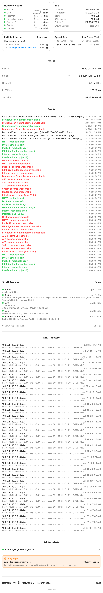

# Bugs

Actual defects — something behaving incorrectly, as distinct from
`PUNCHLIST.md`'s feature ideas, testing tasks, and decisions. Each entry
carries status/severity/build so this can be scanned quickly; the
narrative detail underneath is the investigation, kept in full rather
than summarized away.

**Fields, per entry:**
- **Status** — Open / Investigating / Fixed.
- **Severity** — impact-based, not a formula. **High**: a core,
  advertised feature is silently broken, or broken on an entire
  platform/machine. **Medium**: real incorrect behavior or misleading
  data, but not crashing and not blocking the app's main purpose.
  **Low**: a real defect, but narrow, cosmetic, or ambiguous enough that
  the "correct" behavior itself needs a decision.
- **Found in build** — the git short-hash the bug was actually observed
  on, in the same `Build <hash>[+dirty]` format the app's own popover
  footer already uses (`BuildInfoService`/`ContentView`'s "Build …"
  line) — read it straight off the running app rather than guessing from
  `git log`. Lets a fix be checked against the exact code that was
  broken, not "whatever HEAD happens to be." Add **Fixed in build** once
  resolved, same format.
- **Screenshots** — optional, for anything visual. Save under
  `docs/images/bugs/` (sibling to `docs/images/`, which
  `docs/user-guide.md` already uses the same way) and embed with
  ``; omit the field entirely
  for bugs with nothing to show.

## Open

### First traceroute after joining a network reports inflated latency

- **Status**: Open, root-caused, two fix options proposed
- **Severity**: Medium — misleading data shown right after every new
  network join, not a crash or data loss.
- **Found in build**: not recorded — reported before this field existed
- **First reported**: off-site testing at Martha's

`traceroute -n -q 1 -w 1 -m 4` sends exactly one probe per hop with no
retry, and runs immediately on topology change — before a fresh Wi-Fi
association has settled. Same class of bug this app has hit before (DNS
answers served from a stale cache, HTTP likewise): the *first*
measurement after a network event isn't representative, and nothing
currently distrusts it.

**Proposed fix**, two options, not mutually exclusive: automatically
re-run the trace a few seconds after the first one on a *new* network
(mirrors the "re-derive when a dependency resolves" pattern already used
elsewhere in `NMSApp`'s wiring); or don't display/store the very first
trace's latency as trustworthy. A blanket `-q 2`+ would also help but
costs time on every trace, not just the first.

### A network-transition event can be filed under the wrong network's Events tab

- **Status**: Open, mechanism traced, needs a decision (not just a fix)
- **Severity**: Low — one event, names both networks by design, nothing
  about the origin network's other history is exposed. Real, but narrow.
- **Found in build**: not recorded — reported before this field existed
- **First reported**: off-site testing at Martha's

In `wireTopologyChangeFanOut`, `networkIdentity.reset()` (clears
`currentNetworkFingerprint` to `nil`) runs *before* `wifiSSID.refresh(...)`
in the same closure. `WiFiSSIDViewModel.sample()` →
`logNetworkChangeIfNeeded` logs the `"X → Y"` event synchronously right
there — while the fingerprint is still `nil`, since `lanDiscovery.scan()`
(and therefore `recognize()`) is async and hasn't resolved the new
network yet. `adoptUntaggedRecords` then sweeps that `nil`-tagged event
into whichever network resolves next: the new one.

So today: leaving "Thistle" for "Guest" logs an event that names Thistle
but lives under Guest's Events tab.

**Not a clean fix** — it's genuinely ambiguous which network such an
event belongs to, and "lives under the destination, names the origin"
wasn't a deliberate choice, just what the reset-before-log ordering
happens to produce. Three real options, no strong pull toward any one:
leave it (simplest, arguably correct — read *while on* the new network),
log it under the *old* fingerprint by capturing it before `reset()` runs
(arguably more correct — the transition is what just ended), or log it
under both.

### No window comes to the front on the MacBook

- **Status**: Fixed, confirmed on the MacBook — see below for a second,
  related gap found and fixed during confirmation.
- **Severity**: High — three separate entry points (Open in Window,
  Preferences, Known Networks) completely broken on this machine, while
  all three work on the iMac from the same build.
- **Found in build**: not recorded
- **Fixed in build**: `f92b584` (`ContentView.openWindowInFront`);
  auto-open gap below fixed same session, MacBook-local at time of
  writing
- **First reported**: off-site testing at Martha's
- **Confirmed via**: [GitHub issue #6](https://github.com/PJorgens61/NMS/issues/6),
  the MacBook reproducing it live and posting `sw_vers` + the
  `openWindowInFront` log line

That it's *all three* windows is the important part: this isn't a
per-window bug, the whole `openWindowInFront` mechanism is inert on this
machine, so the cause is machine-level, not per-window logic.

**Confirmed: macOS tightened focus-stealing.** The MacBook is on
**macOS 26.5.2** (Build 25F84) against the iMac's 15.7.7 — a real,
large version gap. Reproducing the bug there and clicking Known
Networks logged:

```
ContentView.openWindowInFront | known-networks → known-networks
```

A clean match — `makeKeyOrderFront` ran — but the window still never
came to front; another app (Notes) ended up frontmost instead. That
rules out the timing hypothesis outright (a timing miss would have
logged `NO WINDOW MATCHED`) and confirms the other branch: the specific
window *is* found and made key within this app's own window list, but
the *application itself* never becomes frontmost, so another app's
windows keep rendering on top of it regardless of what NMS did to its
own window.

`NSApp.activate(ignoringOtherApps: true)` has been deprecated since
macOS 14, and later versions increasingly decline to let a background
app pull itself forward this way — exactly this. **Fixed**: swapped to
the modern, no-parameter `NSApp.activate()` in
`ContentView.openWindowInFront` — the window-matching half already
worked correctly and needed no changes. Deployment target is already
macOS 14+, so no availability guard needed.

Built, tested (64/64), relaunched on the iMac without issue — but
that's not a real test of the fix itself, since 15.7.7 never exhibited
the bug in the first place. This needs the MacBook to actually confirm
it.

Background: foregrounding was fixed twice already for the iMac.
`0f8f80e` added `NSApp.activate`; `1ca9dc8` deferred a run loop turn and
then ordered the specific window front by identifier. Neither touches
application-level activation the modern way, which is what this
machine-specific gap needs.

**Confirmed on the MacBook**: pulled `f92b584`, rebuilt, retested all
three entry points. Known Networks and Preferences both now come
correctly to the front — verified visually (screenshots, not just the
log) for both, not just a clean log match this time.

**A second, related gap found during that confirmation, on the same
machine**: `MenuBarLabel.autoOpenWindow` (this session's DEBUG-only
launch-time auto-open, added for headless/scripted verification — see
`PUNCHLIST.md`) calls plain `openWindow(id:)` directly, with none of
`openWindowInFront`'s activation/ordering logic. It's a separate code
path the iMac's fix never touched, and it turned out to have the exact
same failure mode: the window existed but sat behind other apps after
auto-opening at launch. Fixed the same way — added the identical
`NSApp.activate()` + `makeKeyAndOrderFront` sequence, deferred one run
loop turn, to `MenuBarLabel`'s `.task`. Verified visually after
rebuilding: the window is now genuinely frontmost immediately at
launch, confirmed against a live screenshot, not just the resulting log
line (`MenuBarLabel.autoOpenWindow | nms-window → nms-window`).

## Fixed

### "Stamp build info" wrote nothing on the MacBook — footer showed "Build unknown"

- **Status**: Fixed, confirmed on the MacBook against a from-scratch
  DerivedData rebuild plus the full test suite
- **Severity**: Medium — the build-hash label `4104b24` exists
  specifically to make trustworthy was silently absent on every build on
  this machine; not a crash or data loss, but it defeated the exact
  stale-binary detection that caught the persistent store bug above.
- **Found in build**: `unknown` (that's the bug)
- **Fixed in build**: `8da2a9a`+ (see commit)
- **First reported**: filed live via Bug Report, 2026-07-31 13:53 —
  "build id is missing from footer" / "build # is missing from footer"
- **Confirmed via**: reproduced the missing stamp from a completely
  unsandboxed Terminal.app build (ruling out a coding-agent tool sandbox
  as the cause, which was suspected for a while — see the dead end
  below), then fixed and reconfirmed the same way
- **Screenshots**:
  

**Root cause**: the "Stamp build info" script phase (`4104b24`)
declared no inputs and no outputs at all. Xcode's build system had no
way to know the phase needed to run *after* `ProcessInfoPlistFile` —
the built-in phase that generates `Info.plist` from scratch on every
build — so on this machine the two ran in the wrong order: the stamp
script wrote `NMSGitHash`/`NMSGitSubject`/`NMSGitDirty` successfully
(confirmed by having the script read its own write back immediately
after writing it, matching every field written), and then
`ProcessInfoPlistFile` ran afterward and regenerated the whole file
from the template, silently erasing the stamp. That's exactly why it
looked so strange: no error anywhere, a write that succeeded and read
back correctly within the script's own process, yet gone from the same
file (same inode, checked directly) moments later.

**Fix**: declared the built `Info.plist` as an **input** to the "Stamp
build info" phase (`$(BUILT_PRODUCTS_DIR)/$(INFOPLIST_PATH)`), forcing
the build system to run the stamp script after the file that must
already exist for it to modify. Tried declaring it as an *output*
first — the more conventional fix for "my script phase writes this
file" — but that fails outright: `ProcessInfoPlistFile` already
produces that path, so two declared producers of the same file is a
build-graph conflict Xcode refuses to build (`process command with
output ... Info.plist ... depends on ... script phase`). Declaring it
as an input instead establishes the same ordering without claiming to
be a producer.

Verified three ways: incremental rebuild, a full DerivedData wipe (so
the fix doesn't depend on any stale incremental-build state), and the
full test suite (79/79 passing). All three from a plain Terminal.app
build, not through any tool-mediated shell.

**A real dead end along the way, worth recording**: for a while this
looked like it might be an artifact of the coding-agent tool's own
sandboxed shell rather than a genuine project bug — every build up to
that point had gone through it, and Full Disk Access experiments
(needed to check the unified log for a sandbox denial) went down a
separate rabbit hole (the FDA grant needed to go to the actual nested
`com.anthropic.claude-code` bundle, not the outer desktop app, and
neither ultimately explained the symptom). Reproducing the missing
stamp from a completely unsandboxed Terminal.app build ruled that out
directly and pointed back at the real, machine-independent ordering bug
above.

### The persistent store fails to open, and every launch silently starts empty

- **Status**: Fixed
- **Fixed in build**: `7d6db05`+ (see commit below)
- **Severity**: High — the Events log, DHCP History and every other
  persisted history are the app's core record, and all of them read as
  empty on a store that demonstrably holds 230 events. Nothing on screen
  says anything is wrong: an empty Events list renders the friendly
  "No events yet — everything's healthy" copy, which is exactly the
  reading a user would trust.
- **Found in build**: `d20af0a+dirty` (also present on `dead27c+dirty`,
  so it predates today's UI work)
- **First reported**: found incidentally on 2026-07-31 while running the
  test suite for an unrelated UI change — *not* reported by a user, which
  is itself the concerning part

CoreData refuses to migrate the store and `NMSApp.makeModelContainer()`
catches it and falls back to `isStoredInMemoryOnly: true`:

```
Cannot migrate store in-place: Validation error missing attribute values
on mandatory destination attribute
entity=KnownNetwork, attribute=routerMAC
```

`KnownNetwork.routerMAC` and `.subnet` are non-optional `String`s added
in `e2f9ba2`. SwiftData's lightweight migration can't add a mandatory
attribute to a table that already has rows, and there's no
`SchemaMigrationPlan` in the project to do it the heavy way.

**What's verified.** On disk, `ZKNOWNNETWORK` has no `ZROUTERMAC` or
`ZSUBNET`, and `ZAPPEVENTRECORD` has no `ZNETWORKFINGERPRINT` — all three
added in `e2f9ba2`. The live app logs `EventLogViewModel.events | []`
exactly once at startup and never again, against 230 rows in the file.
The 11:26 bug-report screenshot from earlier the same day already showed
"No events yet," so this is not new today. Data is **stranded, not
destroyed** — the file is intact and every row is still readable via
`sqlite3`.

**The contradiction that looked impossible, resolved.** The newest event
*in the file* was 11:26:16 that same day, written into the old 6-column
table — which no build after `e2f9ba2` could have done. The answer was
that **the running app was a stale binary**: `e2f9ba2` landed
2026-07-30 11:00, and the `.app` actually running had been built
2026-07-29 12:26, before it. That binary's model matched the on-disk
schema exactly, so it opened the store and wrote to it happily. Only a
freshly-built binary hits the migration failure.

Two things hid this, and both are worth remembering:

1. **`BuildInfoService` reads the git hash at *runtime*, from a hardcoded
   checkout path** — so the footer showed `dead27c+dirty`, the repo's
   current state, on a two-day-old binary. The one indicator that should
   have caught "you're not running what you think you are" is
   structurally incapable of it. (Already documented as a limitation in
   that file, but the consequence hadn't been connected to this.)
2. **Two `DerivedData` directories exist** for this project, so a
   glob-based `open` could launch either one.

**Why it stayed invisible.** The fallback's only signal was a `print()`
to stdout, which nothing captures — not `UIStateLogger`, so not
`ui-state.log`, not the state dumps, not a bug report. Combined with an
empty Events list rendering as "everything's healthy," a database that
wouldn't open looked exactly like a quiet, well-behaved network.

**Blast radius.** Anyone whose store predates `e2f9ba2` and who builds
fresh — which is everyone, on their next build — loses all visible
history and persists nothing, with no indication.

**The fix**, three parts:

1. **`KnownNetwork.routerMAC`/`.subnet` are now derived from
   `fingerprint` rather than stored beside it.** `fingerprint` is defined
   as `routerMAC|subnet`, so the same values were being written twice and
   the copies could in principle disagree; storing them is what created
   two mandatory attributes lightweight migration can't add. *Dropping*
   attributes is something it handles fine, so removing them is what let
   the store open. Nothing queries or sorts on either — both are
   display-only — so no predicate needed them to be real columns.
2. **The fallback is loud now**: logged via `UIStateLogger` (so it lands
   in `ui-state.log`, state dumps and bug reports) and surfaced as a red
   popover banner — "Database unavailable — history is hidden and nothing
   is being saved" — with the underlying error as its tooltip.
3. **A latent second bug, exposed by fixing the first.** Once the store
   opened, Events *still* showed empty. `EventLogViewModel.refresh()` and
   `DHCPLeaseViewModel`'s history fetch both run in `init`, before the
   first LAN scan has identified the network, so both query with no
   fingerprint and come back empty — and nothing re-ran them. Events only
   re-read when a *new* event is logged, and events are logged on change,
   so a healthy network could sit showing "No events yet" over a full
   history indefinitely; DHCP history only re-read when a lease changed,
   typically a day out. Added
   `NetworkIdentityViewModel.onNetworkRecognized`, wired to re-read both.
   Latent all along, but unobservable while every record was untagged —
   the launch-time fetch matched them anyway.

**Verified against the real store**: migrates in place, 230/230 events
preserved, `PRAGMA integrity_check` ok, all 4 `KnownNetwork` rows intact
— including one legacy MAC-only fingerprint from before the subnet joined
the key, which now reports an empty subnet rather than failing.
`timesSeen` incremented 43 → 44 on the first run, confirming writes
persist again. The log shows `EventLogViewModel.events | []` at init
followed by the full history ~0.8s later, once recognition completes.
77 tests in 15 suites pass, including 4 new ones pinning the fingerprint
derivation and that legacy row.


(Move an item here with **Fixed in build**, a one-line resolution note,
and the commit hash, rather than deleting it, so there's a record of
what broke and how it got fixed.)

### Known Networks silently never adds an unfamiliar network

- **Status**: Fixed
- **Severity**: High — the entire per-network history feature depends on
  recognition succeeding; a network that fails to recognize gets no
  Known Networks entry and no scoped history, permanently, for that
  network.
- **Found in build**: not recorded — reported before this field existed
- **Fixed in build**: `d5661da`
- **First reported**: off-site testing at Martha's

`NetworkIdentityViewModel.recognize(routerAddress:subnetMask:from:)`
required the router's MAC to already be present in that *one* LAN scan's
ARP results (`devices.first(where: { $0.ipAddress == routerAddress
})?.macAddress`) — if it was missing, the guard just `return`ed. No
retry, no log line, nothing else re-triggered recognition for the rest of
the session unless another topology change happened to fire a fresh
scan.

That guard failing on an unfamiliar network was plausible: joining fires
the scan almost immediately, and if macOS's own ARP cache hasn't resolved
the gateway yet — a real race this codebase has hit before
(`SNMPViewModel.refreshARPIfMergeDataIsStale`'s doc comment describes
exactly this after a Wi-Fi reconnect) — the guard failed silently and
permanently.

**Fix**: split the combined guard so this one retriable case (router
address and subnet known, MAC missing) is distinguished from the
legitimate "no interface yet" case. On that specific failure, logs it
and fires a new `onRecognitionPending` hook exactly once per topology
change (`NetworkIdentityViewModel.hasRequestedRetry`, reset alongside
the rest of `reset()`'s state); `NMSApp` wires that to a single
3-second-delayed re-scan — long enough for the OS to catch up, without
meaningfully delaying a legitimately new network's first recognition.

Verified: clean build, relaunched, existing recognition on the stable
home network unaffected (no regression — the MAC lookup still succeeds
on the first try there, so the new retry path isn't even exercised in
that case, as expected). The retry path itself needs an actual slow-ARP
race to exercise, which isn't reproducible from this session — same
limitation as the original report, only ever seen off-site.

### Bug Report produced no visible UI in the app window

- **Status**: Fixed
- **Severity**: High — the feature was completely non-functional in the
  window (silently did nothing), while working correctly in the
  popover, with no error or indication anything was wrong.
- **Found in build**: e1d5c0d
- **Fixed in build**: e1d5c0d (same build — found and fixed within one
  session)
- **First reported**: field-tested and filed through the app's own Bug
  Report button, in the window, immediately after the button shipped —
  "bug reporting in the app window doesn't work. no orange box."

Root cause: the window scene composed `ContentView.scrollableContent`
and `.footerBar` as two separate children of a `VStack` declared in
`NMSApp`, rather than embedding `ContentView` itself. `ContentView` was
therefore never placed in the tree as one identified node — only
fragments of its computed output were — so SwiftUI had no stable
identity to persist `@State` against. `contentView(isInWindow:)`
constructs a fresh `ContentView` (fresh default `@State`) on every
re-render; a tap on Bug Report did set `isReportingBug = true` and did
schedule a re-render, which then rebuilt the view from scratch and
reset it straight back to `false` — indistinguishable from the button
doing nothing at all.

Fixed by moving the pinned-footer composition inside `ContentView.body`
itself (an `isInWindow` branch using the same `NoBounceScrollView`
pattern), so `ContentView` is always embedded as a single,
stably-identified view regardless of which scene hosts it.
`NMSApp.comparisonWindowContent` went back to a single direct
`contentView(isInWindow: true)` call, same shape as the popover's own.

Verified end-to-end: built, relaunched, clicked Bug Report in the
window via Accessibility scripting, waited 2+ seconds (spanning at
least one connectivity re-render) before screenshotting to confirm the
box persists rather than just surviving one frame — then watched a real
report get typed and submitted through it live.

### Window captures were missing content, and the comment field rendered as a glitch

- **Status**: Fixed
- **Severity**: High — every window-mode Screenshot/Bug Report capture
  silently lost most of its content, and the one control unique to Bug
  Report rendered as an unreadable graphical glitch instead of text.
- **Found in build**: e1d5c0d (introduced by the state-identity fix
  above, same build)
- **Fixed in build**: e1d5c0d
- **First reported**: field-tested and filed through the app's own Bug
  Report button, in the window, immediately after the state-identity
  fix above shipped — comment was itself a question ("i did some wifi
  network switching. thoughts?"), but the attached screenshot showed
  the real defect: everything above the Bug Report box was missing, and
  the comment field was a solid yellow bar with a red "prohibited"
  glyph instead of any visible text.

Two distinct causes, both `ImageRenderer` limitations, both introduced
by the same fix:

1. **Missing content**: fixing the state-identity bug above meant
   moving `NoBounceScrollView` inside `ContentView.body`'s `isInWindow`
   branch. `ImageRenderer` can't render `NoBounceScrollView`'s
   `NSViewRepresentable` content off-screen any better than it renders
   a plain `ScrollView` (see `ScreenshotService`'s own doc comment,
   quirk 1) — every window capture was silently missing
   `scrollableContent` entirely. Confirmed by the resulting PNGs
   shrinking from 300-700KB to ~42KB. Fixed the same way as that
   already-documented quirk: skip the scroll wrapper and render
   `scrollableContent` plain/unclipped when `isCapturingScreenshot`.
2. **Glitched text field**: `TextField` with `.roundedBorder` styling
   is `NSTextField`-backed the same way a bordered `Button` is
   `NSButton`-backed (the reason `.buttonStyle(.plain)` exists), so it
   hits a related but worse rendering gap off-screen. Adding
   `.textFieldStyle(.plain)` to the capture chain (same place
   `.buttonStyle(.plain)` already lives, in `ScreenshotViewModel`) was
   **not sufficient on its own** — confirmed by a second real capture
   still showing the identical glitch. Actually fixed in
   `ContentView.bugReportRow`: swap the `TextField` for a plain `Text`
   showing the same content when `isCapturingScreenshot`, rather than
   asking `ImageRenderer` to draw the control at all — the same
   principle as fix 1, applied one level more locally since this
   control (unlike a `ScrollView`) has no existing capture-mode
   fallback to reuse.

Verified against two real, independently-submitted field reports (not
just forced tests): the first showed both defects together, confirming
the diagnosis; after both fixes shipped, a second real submission
("lookd good") showed full content and clean, readable comment text.
