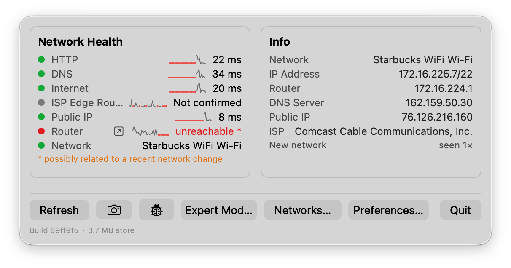

# NMS — User Guide

A menu bar utility that watches your Mac's network path — router, ISP
edge, DNS, HTTP, and any switches/APs you point it at — and tells you
what actually broke.

## Contents

1. [Install & authorize](#1-install--authorize)
2. [The menu bar icon](#2-the-menu-bar-icon)
3. [Anatomy of the popover](#3-anatomy-of-the-popover)
4. [The web pages](#4-the-web-pages)
5. [Usage scenarios](#5-usage-scenarios)
6. [Reference tables](#6-reference-tables)
7. [Troubleshooting](#7-troubleshooting)
8. [What it deliberately won't do](#8-what-it-deliberately-wont-do)

## 1. Install & authorize

NMS is a single unsigned `.app` — no installer, no account, no
configuration file. Everything it shows comes from reading your Mac's
own network state directly.

**1. Move it somewhere permanent.** Drag `NMS.app` into `/Applications`
(or anywhere you like — it has no installer and writes nothing outside
its own app-support folder). Running it from Downloads works too, it
just won't survive a cleanup pass.

**2. Get past Gatekeeper.** NMS is built and signed locally, not
notarized by Apple, so the first launch is blocked. Double-clicking it
gives you a dead end ("Apple could not verify…" with no Open option).
Instead:

- Control-click (or right-click) `NMS.app` → **Open** → confirm **Open**
  in the dialog, *or*
- If that doesn't offer an Open option: **System Settings → Privacy &
  Security**, scroll to Security, click **Open Anyway** next to the NMS
  mention, then launch it again and confirm.

You only do this once. After the first successful launch, it opens
normally from then on.

**3. Grant Local Network access.** Almost immediately after launch,
macOS asks: *"NMS would like to find and connect to devices on your
local network."* Click **Allow** — without it, NMS can only reach as
far as your router, and SNMP/LAN discovery return nothing.

**4. Location access — only if you use Wi-Fi.** macOS treats a Wi-Fi
network's name (SSID) as location-sensitive, so reading it needs
Location permission. NMS only asks the moment it's actually needed — the
first time you're connected over Wi-Fi rather than Ethernet. Decline and
NMS keeps working, it just shows "Wi-Fi" instead of the network's name.

> **Optional — launch at login.** NMS has no built-in login-item
> setting. To start it automatically: **System Settings → General →
> Login Items & Extensions**, then add NMS under "Open at Login."

> **What it needs, and doesn't.** No account, no cloud service, no
> phone-home. Local Network and (optionally) Location are the only two
> permissions it asks for, both explained above — everything NMS
> displays is read directly from this Mac.

## 2. The menu bar icon

One glance tells you whether anything needs your attention — click it to
open the popover, click anywhere else to close it.

| Color | Meaning |
|---|---|
| 🟢 Green — normal | Everything on the critical path (router, ISP edge, internet, DNS, HTTP, public IP) is reachable. |
| 🟡 Yellow — marginal | The critical path is fine, but something you're separately watching — an SNMP-monitored switch or AP, or a configured printer — isn't answering. |
| 🔴 Red — critical | Your network interface is down, or one of the critical-path checks is failing. Something is actually broken. |

This is a strict priority order, not a count — one critical failure
means red even if everything else is fine, and a marginal issue never
escalates to red on its own.

## 3. Anatomy of the popover

> **A note on the screenshot below.** It predates this popover's current
> shape (from before the switch to the status-line + Simple/Expert
> layout described here) and hasn't been recaptured yet — a known,
> flagged gap, not an oversight. Read the text below for what you'll
> actually see today.



The popover stays deliberately small on purpose — glance status and
action triggers only. Everything data-dense (history, per-device detail,
full test results) lives one tap away on [the web pages](#4-the-web-pages)
instead, opened in your regular browser, so the popover itself stays
this short no matter how much diagnostic detail NMS accumulates.

### Status lines

Three rows, each a colored dot plus a short detail, tap anywhere on the
row to open its detail page in your browser:

| Row | What it means | Opens |
|---|---|---|
| **MyApps** *(only shown if SaaS monitoring is on)* | Worst status across every SaaS vendor you're monitoring | [`/saas`](#saas) |
| **Internet** | Is the internet actually reachable past your own router — public internet, DNS, HTTP, and (once confirmed) your ISP's own edge router | [`/network`](#network) |
| **MyWifi** *(labeled this even on Ethernet — a known small gap)* | Local link health — interface up, router reachable, DHCP behaving normally | [`/network`](#network) |

Below the three status lines, a compact glance line always shows your
current connection detail — SSID/signal/channel on Wi-Fi, speed/duplex
on Ethernet.

### Simple / Expert

A segmented toggle switches between two control sets. Both share the
same status lines and glance line above — Expert Mode only adds
controls, it never changes what's displayed.

**Simple Mode** — two controls:
- **View Network Summary** opens [`/network`](#network).
- **Run Quick Check** runs a bundle of five gentler tests in one go — a
  path trace, a DNS check, a DHCP status check, a small speed probe, and
  a brief Wi-Fi/Ethernet stress burst — behind one upfront confirmation
  (it does move some real data). Deliberately excludes anything with a
  lasting side effect (renewing your DHCP lease) or anything
  enterprise-oriented (SNMP/firewall scanning) — see
  [Scenario B](#scenario-b--is-it-my-wi-fi-or-is-the-whole-internet-down)
  for what to do with the result.

**Expert Mode** — Simple Mode's two controls, plus a **Run Test ▾** menu
covering every individual test on its own: Trace Now, Check DNS, Check
DHCP Status, Run Speed Test, Run Apple Test, Run Wi-Fi Stress Test, Scan
(SNMP), Scan Now (Firewall), and Renew (DHCP) — each with its own
one-time confirmation where the action has a real effect (moves real
data, or actually renews your lease). Every test's result lands on
[`/network`](#network) or [`/log`](#log--diagnostic-log) once it finishes.

Below the tests: **Known Networks…** opens the list of every network NMS
has recognized (see
[Scenario E](#scenario-e--recognizing-youre-on-a-different-network)).
**Preferences…** opens toggles for experimental features — whether to
turn on SNMP Devices (off by default) and SaaS monitoring (on by
default), which SaaS services to monitor, and any sites you've added
yourself. Every toggle applies immediately, no restart needed. The
small gray line at the bottom shows the build hash.

## 4. The web pages

Everything more diagnostic than a glance opens in your regular browser
— NMS runs a small local web server on `127.0.0.1` only (nothing on
your network can reach it), so these pages are as private as anything
else NMS shows, just easier to read at length than a cramped popover
would allow.

### `/network`

The full local-link/internet picture, ordered bottom-to-top as the
actual path out of your Mac — read it that way when something's wrong,
since a failure low in the list explains everything failing above it:
Network, Local Router, Public IP, ISP Edge Router, Internet, DNS, HTTP,
plus DHCP and DDNS status, each a colored dot and its latest reading.
This page shows current status only — no trend history per check right
now (see [What it deliberately won't do](#8-what-it-deliberately-wont-do)).

Also on this page: your Wi-Fi (SSID, signal strength, channel and band,
security) or Ethernet (speed, duplex) glance detail, and **Path to
Internet** — the traced route out to the internet, with the hop you've
confirmed as your ISP's own router starred. The first non-local hop
isn't always the right one to star — a campus or enterprise network can
hand out its own public address space before traffic reaches the actual
ISP; scroll the hop list and pick the correct one if the suggestion
looks wrong. Once starred, that address is pinged on the same cadence
as everything else on this page, not re-traced from scratch each time.

### `/saas`

*On by default* — the one experimental feature that is, since it only
reaches public status pages rather than probing your own network. Lists
the business services you're monitoring (Slack, GitHub, Cloudflare, and
many others — pick which ones in **Preferences…**, or turn the whole
feature off there) with each one's current status and a link to its own
status page. Sites you've added yourself under **Preferences…** show up
separately, under **Your Own Sites** — those are checked for plain
reachability only, not a real vendor status page, so that weaker signal
isn't confused with the curated list's.

### `/log` — Diagnostic Log

A merged, chronological view of everything that happened, plus standing
inventories:

- **Events** — a running log of state changes, not a stream of every
  check. Most entries are transition pairs: an outage produces one red
  line when it starts and one green line when it clears. Purely
  informational entries (your public IP changing, a network you've
  switched to or away from, an SNMP device's software updating, a DHCP
  lease changing) render in a neutral color rather than red or green.
- **Speed Test / Apple Test / Wi-Fi Stress Test history** — every run,
  newest first, as a genuine time series.
- **SNMP Devices** — *off by default, turn on under Preferences… first.*
  Active probing of your own LAN, so it's opt-in. Once enabled, any
  switch, access point, or SNMP-capable device NMS reaches on your
  *current* subnet is listed with its name, uptime, and
  software/firmware descriptor — a device that restarts (uptime resets)
  or changes descriptor (a firmware update) logs an event automatically.
  **Scan** (Expert Mode's Run Test ▾ menu) clears the list and
  re-sweeps the subnet from scratch — expect up to 15–20 seconds on a
  full /24. Two devices sharing one physical interface (a common VRRP
  setup) show as one entry with both addresses listed. SNMP community
  strings default to `public`, tried in order against a
  comma-separated list — see the note in
  [Scenario D](#scenario-d--watching-a-specific-switch-or-ap) for how to
  set a different one (no in-app field for it yet).

  Scanning never reaches outside your current subnet — a device only
  visible from a different network (a guest Wi-Fi VLAN on the same
  router, say) won't show up until you're actually on that network.
  **Printers get monitored even without SNMP** — any network printer
  already set up in System Settings → Printers & Scanners gets watched
  for reachability too, reading your Mac's own printer configuration
  rather than relying on discovery.
- **DHCP History** — every time your lease actually changes (a different
  server, address, or timing), recorded newest first; the newest entry
  doubles as your current lease. Each entry is two lines: server and
  assigned address on the first, every other parsed field (broadcast,
  gateway, DNS, domain, lease/T1/T2 timers, transaction ID) on the
  second.

### `/quickcheck`

Simple Mode's **Run Quick Check** landing page. Each bundled test fires
for real and its result lands on `/network`/`/log` as it finishes, the
same as running it individually would — there's no single synchronized
report yet combining all five into one pass/fail summary. A real,
flagged gap, not a bug: worth checking `/network` and `/log` directly a
few seconds after running Quick Check rather than expecting one
combined verdict here.

### `/path-discovery`

Expert Mode's **Run Test ▾ → Path Discovery…** opens this page: a
reverse traceroute run from several external vantage points back toward
your own public IP, checking whether any of them corroborate the hop
you've starred as your ISP's edge — useful when the traceroute-out
suggestion in `/network` looks wrong (see
[Scenario C](#scenario-c--the-suggested-isp-hop-looks-wrong)). Distinct
from **Run Test ▾ → Trace Now**, which just re-runs `/network`'s own
outbound trace in place.

## 5. Usage scenarios

### Scenario A — First time on a new network

1. Open the popover — the **Internet**/**MyWifi** status lines and
   glance line give an immediate read on whether this network looks
   right for where you are; tap either to open [`/network`](#network)
   for the router/DNS/public-IP detail.
2. On `/network`, under **Path to Internet**, star the hop that's
   genuinely your ISP's router. This turns "ISP Edge Router" from "Not
   confirmed" into a real, monitored check.
3. If you manage the switches/APs here, turn on **SNMP Devices** under
   **Preferences…** (off by default), then use Expert Mode's
   **Run Test ▾ → Scan**. Anything that answers gets tracked for
   restarts and firmware changes from then on — see the note under
   [Scenario D](#scenario-d--watching-a-specific-switch-or-ap) about
   setting a non-default community string.

### Scenario B — "Is it my Wi-Fi, or is the whole internet down?"

Check the popover's **Internet** and **MyWifi** status lines first —
they're already split exactly along this line. If **MyWifi** is red,
the problem is local (your Mac, or the router itself); if it's green
but **Internet** is red, your LAN is fine and the break is upstream.
For the full breakdown, open [`/network`](#network) and read it
**bottom to top** — that's the actual path out of your Mac, and the
lowest failing row is almost always the real fault, not the highest one:

- **Network is red** — the interface itself is down (cable, Wi-Fi drop,
  adapter). Nothing past it can be evaluated.
- **Network is green, Local Router is red** — your Mac is fine, but
  nothing beyond it answers: a switch, AP, or the router itself.
- **Local Router is green, ISP Edge Router or Internet is red** — your
  LAN is healthy; the break is upstream, between you and your ISP.
- **Everything below is green, only DNS or HTTP is red** — raw
  connectivity works; this is a resolver or web-filtering problem, not a
  real outage.

### Scenario C — The suggested ISP hop looks wrong

On a campus or enterprise network, the first non-local traceroute hop
can be your own organization's router, not the actual ISP. On
[`/network`](#network)'s **Path to Internet** section, if the suggested
hop's hostname doesn't look like an ISP, scroll the hop list and star
the correct one further down instead — the Internet status line starts
monitoring that address immediately. If it's still unclear which hop is
real, Expert Mode's **Run Test ▾ → Path Discovery…** opens
[`/path-discovery`](#path-discovery) for a second opinion from outside
your network.

### Scenario D — Watching a specific switch or AP

Turn on **SNMP Devices** under **Preferences…** if you haven't already
(off by default). The community string your gear expects defaults to
`public`; there's currently no in-app field to change it (a known gap —
the popover conversion dropped the old inline editor and hasn't replaced
it yet), so set it via Terminal first if your gear uses something else:

```
defaults write Thistle.NMS NMS.snmpCommunities -array "public" "your-string-here"
```

Then use Expert Mode's **Run Test ▾ → Scan** to find it — NMS re-polls
every already-discovered device every minute from then on. Watch
[`/log`](#log--diagnostic-log) for an uptime that resets to zero (an
unplanned restart) or a software descriptor that changes (a firmware
upgrade) — both generate an Events entry the moment they're noticed.

### Scenario E — Recognizing you're on a different network

The **Known network** / **New network** signal is keyed on the router's
own hardware address plus the subnet — not the network's name — so it
correctly tells apart a main LAN from a guest VLAN on the *same* router
(which otherwise share the same hardware address), and recognizes your
own network again after leaving and coming back, even across an
interface change (Ethernet to Wi-Fi).

Events, SNMP Devices, DHCP History, and Wi-Fi/Ethernet detail are all
scoped to whichever network is current: visiting a neighbor's network,
or any network other than your own, never mixes its data into your
usual history, and switching back shows your own history exactly as it
was. **Known Networks…** opens a list of every network NMS has ever
recognized — click into the name field to give a network a label of
your own (e.g. "Home," "Office"), which then shows up throughout the
app in place of the router's hardware address. **Review** opens a
read-only history for that network specifically (its own Events, SNMP
Devices, DHCP History, and Wi-Fi telemetry, exactly as it looked while
you were last on it) — read-only, no export button. **Forget** removes a
network and everything recorded on it, permanently.

## 6. Reference tables

### Status colors

| Color | Meaning |
|---|---|
| Red | Checked, and failing. Read `/network` bottom to top (see [Scenario B](#scenario-b--is-it-my-wi-fi-or-is-the-whole-internet-down)) to find the lowest failing row — that's almost always the root cause, not the ones above it, which every row's color treats identically regardless of whether it's the cause or a consequence. |
| Gray | Not a failure — genuinely not evaluated yet (e.g. ISP Edge Router before you've confirmed a hop). |
| Green | Checked, and reachable. |

### How often things are checked

| Check | Normal interval | Notes |
|---|---|---|
| `/network` checks (all rows) | 30s | Drops to 5s while anything critical is failing; the first failure triggers one extra round immediately |
| SNMP device re-poll | 60s | Only already-discovered devices — a fresh Scan is manual |
| Public IP lookup | 5 min | Also re-checked immediately after any topology change |
| ISP identification | Whenever the public IP changes | Not on its own timer — a registrant only changes when the allocation behind your public IP does |
| Traceroute re-run | 10 min | Also re-run after any topology change, and when internet reachability changes either direction |
| Wi-Fi / Ethernet detail | 60s (Wi-Fi) / on network change (Ethernet) | Ethernet's link speed rarely changes mid-session, so it's re-read on a topology change rather than a timer |

## 7. Troubleshooting

**`snmpget` unavailable on this macOS version.** Apple removed the
underlying command-line tool. Nothing to fix on your end — SNMP
features are unavailable on this Mac.

**SNMP Devices never shows anything in `/log`.** It's off by default —
turn it on under **Preferences…** first, then run Expert Mode's
**Run Test ▾ → Scan**.

**No SNMP devices found (with the feature already on).** Either nothing
on your subnet answers SNMP under the current community string(s), or
it's mid-scan (15–20s on a full /24). There's currently no in-app field
to check or change the community string (see the note in
[Scenario D](#scenario-d--watching-a-specific-switch-or-ap)) — confirm
it via `defaults read Thistle.NMS NMS.snmpCommunities` first.

**A device I know is on my network never shows up in SNMP Devices.**
SNMP scanning is deliberately restricted to your current subnet — a
device only reachable from a different network (a guest VLAN on the
same router, a different Wi-Fi network entirely) won't be found until
you're actually connected to that network yourself.

**Network name never appears on Wi-Fi.** Location permission was
declined. Grant it under **System Settings → Privacy & Security →
Location Services** if you want the SSID shown; NMS otherwise works
fine without it.

**Public IP shows "Not checked" briefly after launch.** Normal — it
resolves within a second or two of opening the app.

**App won't open at all, no dialog.** Revisit step 2 in [Install &
authorize](#1-install--authorize) — this is Gatekeeper blocking an
unnotarized app, not a crash.

**`/network` flashed red briefly, but nothing appeared in Events.**
By design, not a bug. If every path-critical row (Router, Public IP, ISP
Edge Router, Internet) fails at once while DNS or HTTP still succeeds,
NMS treats that as this Mac being too busy to run its own ping checks on
time — not a real outage — and skips logging it. The measurements are
still recorded (visible in `/network` if you happen to reload during the
brief window), just not logged as an event; this is most likely during
something CPU-heavy running at the same time, like a
build.

**Two identical rows for the same device in SNMP Devices.** A real,
known quirk, not a bug in the data: NMS merges a device answering at two
addresses (a common VRRP setup) into one row once it has confirmed both
addresses share the same hardware. Right after a network change, that
confirmation can lag until the next scan, so the same device briefly
shows twice.

## 8. What it deliberately won't do

- No push notifications, email, or remote alerting — it's a menu bar
  indicator you glance at, not a monitoring service.
- Watches from this one Mac's point of view only — it can't tell you
  whether a problem is local to this machine or affects the whole
  network.
- No trend charts right now — `/network` shows each layer's latest
  status only, not a short-term history the way the old popover's
  sparklines did (dropped in the move to the web pages, not yet
  replaced). Events remains a recent-activity log, not a trend graph.
- SNMP discovery covers your current subnet only, strictly — never a
  routed/remote segment, and never a different network you've merely
  visited recently.
- No real-time printer fault detail (out of paper, cover open) — see
  the note under [`/log`](#log--diagnostic-log).

---

*NMS is a personal macOS utility, not a commercial product.*
